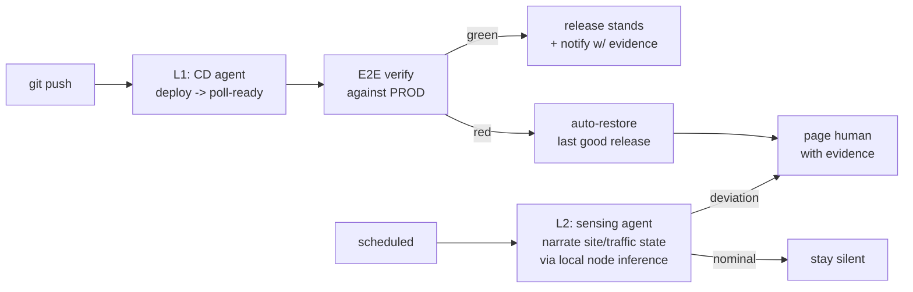

# Autonomous CD + Self-Healing Web Ops
### A multi-agent system that keeps production sites up-to-spec with no human at the keyboard

> **The pitch:** *"I'm never at the computer, yet the site is always up to spec."*

---

## The problem (a real operator's constraint)

I run production web properties for real clients and businesses — including **theimmortalvibes.com**
(an e-commerce storefront) and **gcl-wa.com** (a landscaping business). A solo operator can't watch
them 24/7. Two failure modes cost real money and trust:

1. **A bad deploy ships and nobody's watching** — a broken build reaches production and sits there.
2. **The site silently drifts** — a traffic anomaly, a degraded page, a quietly-failing integration,
   and the first to notice is the customer.

So I built the operator I couldn't be: sites that catch a bad release automatically and surface a real
anomaly before a human would.

## The outcome (what it does, measurably)

- **2 production sites** — theimmortalvibes.com and gcl-wa.com — under autonomous continuous deployment
  with automated rollback and end-to-end verification against production.
- **Rollback recovery in ~72 seconds, unattended** — a drill-verified restore returned gcl-wa.com to its
  last-good release and confirmed it healthy, no human at the keyboard. Healthy-path E2E verification
  against production runs in ~65s. **([Evidence: the actual 72-second rollback run →](https://github.com/gr8-gray/green-collar-landscaping/actions/runs/30847299321))**
- Rollback machinery is **drill-tested, not theoretical**: the restore path — detect → restore last-good
  → re-verify health → record evidence → notify — has executed end-to-end against a live production site.
- **L2 anomaly sensing** is shipped and newly deployed for theimmortalvibes.com: scheduled
  local-inference watchers that narrate site/traffic state and page only on deviation.

## How it works

**L1 — Continuous deployment with automated rollback.** On every push: deploy → poll until ready → run
an end-to-end suite **against production** → if green, the release stands and I'm notified with
evidence; if red, the system **automatically restores the last good release** and pages me with the
failure evidence. The site is never left broken waiting for me. *(See the canonical template in
[`templates/l1-cd-rollback/`](templates/l1-cd-rollback).)*

**L2 — Anomaly sensing / self-healing web ops.** Scheduled watchers narrate each site's health and
traffic state through **local-node inference** (self-hosted — no per-call cloud cost) and push an alert
only when something deviates from spec. Nominal state stays silent — no alert fatigue. *(Core in
[`sensing/`](sensing).)*

**Governance (why it doesn't cascade).** A codified **mistake-ledger** of enforced constraints plus a
**two-iteration hard-stop** — if the same fix fails twice, the system escalates instead of digging the
hole deeper with a third attempt. That discipline is what makes "unattended" safe rather than reckless.

## Why this is forward-deployed engineering

An FDE takes ownership of an ambiguous, real-world reliability problem and ships an autonomous system
that solves it end-to-end — build, verify, recover, observe — against a live customer surface, with
cost and failure discipline built in. That's this repo: requirement (sites must stay up-to-spec
unattended) → shipped system → measured recovery, running in production today.

## Stack

Anthropic SDK (multi-agent orchestration) · GitHub Actions · Playwright E2E · local-node inference for
sensing · Cloudflare / Netlify / Fly deploy targets · scheduled (cron) agents · Python.

## Repository

- **`templates/l1-cd-rollback/`** — the canonical CD auto-rollback workflow (Netlify restore + Cloudflare pointer)
- **`sensing/`** — the L2 anomaly-sensing core (store · anomaly detection · digest · notify · daily run)
- **`tests/`** — TDD suite for the sensing core

---
*Built and operated by **Eric Gray** — AI/Agent Engineer · Forward-Deployed Engineer · U.S. Marine Corps
veteran · active Secret clearance.
[gr8gray.dev](https://gr8gray.dev) · [github.com/gr8-gray](https://github.com/gr8-gray)*
