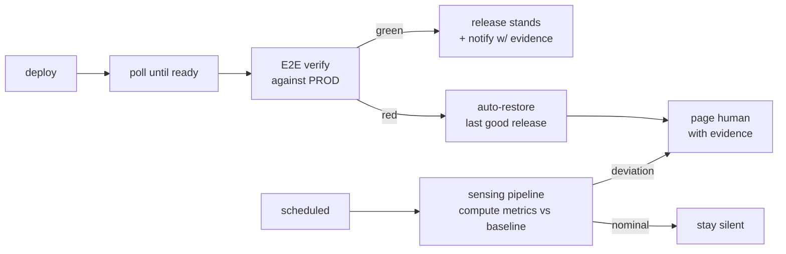

# CD Rollback + Anomaly Sensing for Small Production Sites

### A CI/CD workflow template with automated rollback, plus a scheduled anomaly-sensing/alerting layer

> **The idea:** *catch a bad release automatically, and surface a real anomaly before a customer does — for a solo operator who can't watch the sites 24/7.*

---

## The problem (a real operator's constraint)

I run two small production sites — **theimmortalvibes.com** (a personal e-commerce storefront) and
**gcl-wa.com** (a landscaping business). A solo operator can't watch them 24/7. Two failure modes cost
real money and trust:

1. **A bad deploy ships and nobody's watching** — a broken build reaches production and sits there.
2. **The site silently drifts** — a traffic anomaly, a degraded page, a quietly-failing integration,
   and the first to notice is the customer.

So I built two pieces to cover those gaps: a CD workflow that catches a bad release and rolls it back
automatically, and a scheduled watcher that flags a real anomaly and alerts me.

## What it does

- **CD with automated rollback + post-deploy verification** — a GitHub Actions workflow template:
  on deploy it polls until ready, runs an end-to-end suite against production, and if that suite fails
  it automatically restores the last-good release and pages me with the failure evidence.
- **Rollback drill: gcl-wa.com restored in ~72 seconds, unattended** — a drill exercised the full
  restore path against the live site and confirmed it healthy with no human at the keyboard. The
  healthy-path end-to-end verification runs in ~65s.
  **([Evidence: the actual rollback Actions run →](https://github.com/gr8-gray/green-collar-landscaping/actions/runs/30847299321))**
- The rollback path — detect → restore last-good → re-verify health → record evidence → notify — is
  **drill-tested against a live site, not theoretical**.
- **Scheduled anomaly sensing / alerting** — a daily pipeline that computes each site's metrics against
  a 7-day baseline, flags deviations with deterministic threshold rules, and alerts only on a flag.
  Nominal state stays silent — no alert fatigue.

## How it works

**L1 — CD with automated rollback.** On deploy: poll until ready → run an end-to-end suite **against
production** → if green, the release stands and I'm notified with evidence; if red, the workflow
**automatically restores the last-good release** and pages me with the failure evidence. *(Canonical
template in [`templates/l1-cd-rollback/`](templates/l1-cd-rollback).)*

**L2 — Anomaly sensing / alerting.** A scheduled Python pipeline (`store → anomaly → digest → narrate →
notify`) computes each site's metrics against a 7-day baseline. Detection is **deterministic threshold
rules** (e.g. flag when revenue drops below the 7-day average by more than a set percentage) — every
number is computed in code. A small **local Ollama model** is used only to write the prose around those
flags; by design it renders no figures and can never introduce or alter one. It runs self-hosted, so
sensing has no per-call cloud cost. *(Core in [`sensing/`](sensing).)*

**Failure discipline.** A codified mistake-ledger of enforced constraints plus a two-iteration
hard-stop: if the same fix fails twice, the system escalates instead of attempting a third time.

## Stack

Python · GitHub Actions · Playwright (end-to-end verification) · local Ollama inference for sensing
narration · scheduled (cron) runs · Cloudflare / Netlify / Fly deploy targets.

## Repository

- **`templates/l1-cd-rollback/`** — the CD auto-rollback workflow template (Netlify restore + Cloudflare pointer)
- **`sensing/`** — the anomaly-sensing pipeline (store · anomaly detection · digest · narrate · notify · daily run)
- **`tests/`** — TDD suite for the sensing core

---
*Built and operated by **Eric Gray** — Software Engineer · U.S. Marine Corps veteran · active Secret
clearance. [gr8gray.dev](https://gr8gray.dev) · [github.com/gr8-gray](https://github.com/gr8-gray)*
